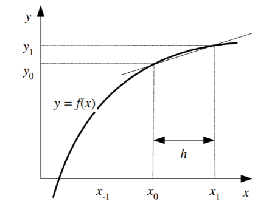

# Algoritma

## Hampiran Selisih Maju  

Hampiran selisih maju mencari turunan yaitu mencari kemiringan garis (gradien) dengan mengambil selisih yang ada di depannya yang ditunjukkan pada gambar di bawah ini[^1]

dimana x0 - x1 dapat diganti dengan h

$$
(\frac{y_1-y_0}{x_0-x_1}) = (\frac{f_1-f_0}{h})
$$

### Rumus Dasar

$$
f'(x_0) = (\frac{f(x_o+h)-f(x_0)}{h}) = (\frac{f_1-f_0}{h})
$$

h -> 0 (h mendekati 0) agar error relatifnya kecil juga, untuk mencari errornya dapat dilakukan dengan menghitung seperti rumus di bawah ini, yaitu melakukan pembagian antara turunan eksak (sebenarnya) dengan turunan maju

$$
E(f) = -(\frac{1}{2})hf'(x)
$$

### Algoritma

#### Deret Taylor
Menjabarkan turunan sesuai dengan deret taylor, dimana diketahui bahwa rumus dasar dari deret taylor adalah seperti ini

$$
\sum_{k=0}^\infty \frac{f^{(n)}(a)}{n!} (x-a)^n
$$

Sehingga untuk mencari hampiran selisih maju dengan deret taylor akan menjadi seperti ini,

$$
f(x_{i+1}) = f(x_i) + \frac{x_{i+1}-x_i}{1!} f'(x_i) + \frac{(x_{i+1}-x_i)^2}{2!} f''(x_i)+..
$$

Rumus di atas apabila diteruskan akan mendapatkan hasil seperti berikut,

$$
O(h) = h/2 f'' (t), x_i<t<x_{i+1}
$$

Untuk nilai f di x0 dan x1 menjadi dimana O(h) merupakan orde errornya yang tergantung nilai dari h yang merupakan galat pemotongan dari f sebelumnya. Berikut adalah rumus turunan pertama selisih maju dengan deret taylor

$$
f0' = \frac{f_1 - f_0}{h} + O(h)
$$

#### Polinom Interpolasi

Polinom newton-gregory dapat digunakan untuk menyelesaikan permasalahan turunan numerik yang memiliki titik-titik yang berjarak sama sehingga rumus yang dipakai lebih sederhana dibandingkan polinom interpolasi yang lain. Berikut ini adalah polino newton-gregory untuk selisih maju pada turunan pertama

$$
f'(x_0) = \frac{3f_0 + 4f_1 - f_2}{2h}
$$

## Hampiran Selisih Mundur

Hampiran selisih mundur mencari turunan yaitu mencari kemiringan garis (gradien) dengan mengambil selisih yang ada di belakangnya / bawahnya yang ditunjukkan pada gambar di bawah ini

### Rumus Dasar

$$
f'(x_0) = (\frac{f(x_o)-f(x_0+h)}{h}) = (\frac{f_0-f_1}{h})
$$

### Algoritma

#### Deret Taylor

Sama halnya dengan step selisih maju, namun rumus untuk mencari hampiran selisih mundur dengan deret taylor terdapat perubahan yaitu dimulai dari yang terakhir sampai yang awal

$$
f(x_{i-1}) = f(x_i) + \frac{x_{i+1}-x_i}{1!} f'(x_i) + \frac{(x_{i+1}-x_i)^2}{2!} f''(x_i)+..
$$

Rumus di atas apabila diteruskan akan mendapatkan hasil seperti berikut,

$$
O(h) = -h/2 f'' (t), x_{i-1}<t<x_{i}
$$

Sehingga rumus untuk turunan pertama selisih mundur dengan deret taylor yaitu,
$$
f0' = (\frac{f_0-f_1}{h}) + O(h)
$$

#### Polinom Interpolasi

Polinom newton-gregory dapat digunakan untuk menyelesaikan permasalahan turunan numerik yang memiliki titik-titik yang berjarak sama sehingga rumus yang dipakai lebih sederhana dibandingkan polinom interpolasi yang lain. Berikut ini adalah polino newton-gregory untuk selisih maju untuk titik-titik x0 & x-1 pada turunan pertama

$$
f'\left( x_{0}\right) =1/h\left( \nabla f\circ \right) =\dfrac{f_{0}-f_{-1}}{h}
$$

## Hampiran Selisih Pusat

Hampiran selisih pusat mencari turunan yaitu mencari kemiringan garis (gradien) dengan mencari gabungan dari selisih maju dan selisih mundur. 

### Rumus Dasar

$$
f'(x_0) = (\frac{f(x_o+h)-f(x_o-h)}{2h}) = (\frac{f_1-f_{-1}}{2h})
$$

### Algoritma

#### Deret Taylor

Perhitungan dengan menggunakan rumus mengurangkan persamaan maju dan mundur, yang dapat dilihat dari rumus di bawah ini

$$
f(x_{i+1})-f(x_{i-1}) = 2hf'_i + h^3/3 fi'' + ...
$$

Rumus di atas apabila diteruskan akan mendapatkan hasil seperti berikut,

$$
O(h^2) = -h/6 f'''(t), x_{i-1}<t<x_{i+1}
$$

Sehingga rumus turunan pertama untuk selisih pusat ,
$$
f0' = (\frac{f_1-f_{-1}}{2h}) + O(h^2)
$$

#### Polinom Interpolasi

Polinom newton-gregory dapat digunakan untuk menyelesaikan permasalahan turunan numerik yang memiliki titik-titik yang berjarak sama sehingga rumus yang dipakai lebih sederhana dibandingkan polinom interpolasi yang lain. Berikut ini adalah polino newton-gregory untuk selisih pusat untuk titik-titik x-1, x0, dan x1 pada turunan pertama

$$
f'\left( x_{0}\right) =\dfrac{f_{1}-f_{-1}}{2h}
$$

## Referensi

[^1]: [Materi Kuliah Komputasi Numerik ITB Prof. Rinaldi Munir](https://informatika.stei.itb.ac.id/~rinaldi.munir/MetNum/2010-2011/Turunan%20Numerik.pdf) 